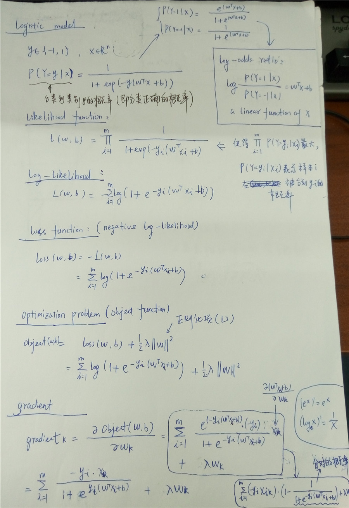
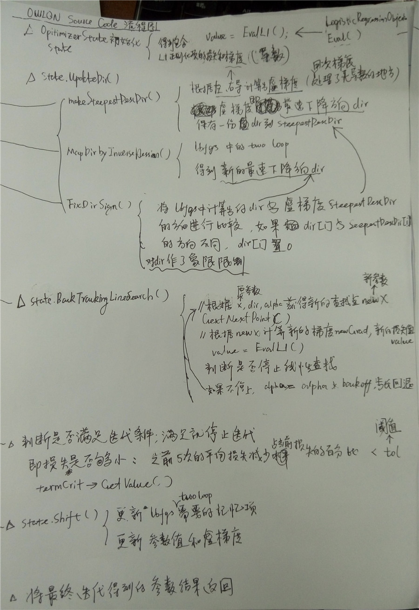

# LogisticRegression_OWLQN_Notes
逻辑回归和OWLQN优化算法学习笔记，这个笔记围绕[Galen Andrew and Jianfeng Gao. 2007](http://research.microsoft.com/en-us/downloads/b1eb1016-1738-4bd5-83a9-370c9d498a03/default.aspx)
这篇论文实现的代码来整理逻辑回归、OWLQN的原理和实现。

## 代码
上面的代码是[Galen Andrew and Jianfeng Gao. 2007](http://research.microsoft.com/en-us/downloads/b1eb1016-1738-4bd5-83a9-370c9d498a03/default.aspx)论文中附带的。在这里对代码添加了比较详细的注释，详细代码参见目录中的其它文件。其中对虚梯度部分计算的注释如下：
```cpp
//OWLQN
//计算下降方向dir（参数的一阶梯度，虚梯度的负方向）
void OptimizerState::MakeSteepestDescDir() {

	if (l1weight == 0) {
		//l1正则化项权值为0时，查找方向dir为损失函数梯度的负方向
		scaleInto(dir, grad, -1);
	} else {
		//l1正则化项权值不为0时，根据损失函数的梯度和l1正则化项权值来确定查找方向
		for (size_t i=0; i<dim; i++) {
			if (x[i] < 0) {
				//xi<0时，|xi| = - xi，l1处的倒数为-l1weight，下降方向为梯度的反方向
				dir[i] = -grad[i] + l1weight;
			} else if (x[i] > 0) {
				//xi>0时，|xi| = xi，l1处的倒数为l1weight，下降方向为梯度的反方向
				dir[i] = -grad[i] - l1weight;
			} else {//xi == 0
				if (grad[i] < -l1weight) {
					//xi == 0，右导grad[i] + l1weight < 0，虚梯度取右导，下降方向为虚梯度的反方向，dir[i] > 0，偏向正象限
					dir[i] = -grad[i] - l1weight;
				} else if (grad[i] > l1weight) {
					//xi == 0，左导grad[i] - l1weight > 0，虚梯度取左导，下降方向为虚梯度的反方向，dir[i] < 0，偏向负象限
					dir[i] = -grad[i] + l1weight;
				} else {
					//xi == 0，左右导数都为0，下降方向为0
					dir[i] = 0;
				}
			}
		}
	}

	//记录当前的最速下降方向
	steepestDescDir = dir;
}
```

## Logistic Regression
* 逻辑回归的公式



* 代码中逻辑回归对应的公式和计算流程


## OWLQN
### 相关论文
* BFGS, LBFGS: [Anders Skajaa.Limited Memory BFGS for Nonsmooth Optimization.2010](http://www.cs.nyu.edu/overton/mstheses/skajaa/msthesis.pdf)
* LBFGS:[J. Nocedal and S. Wright. Numerical Optimization. Springer, 2nd
edition, 2006.](http://home.agh.edu.pl/~pba/pdfdoc/Numerical_Optimization.pdf)
* OWLQN:[Galen Andrew and Jianfeng Gao.Scalable Training of L1-Regularized Log-Linear Models.2007](http://research.microsoft.com/en-us/um/people/jfgao/paper/icml07scalable.pdf)
### 一些问题
* LBFGS的局限性

* OWLQN对LBFGS的改进

### 代码中OWLQN的计算流程



## 相关的项目
[并行逻辑回归](https://github.com/strint/DML/tree/master/logistic_regression)
